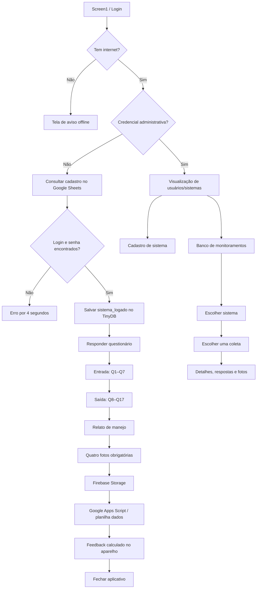
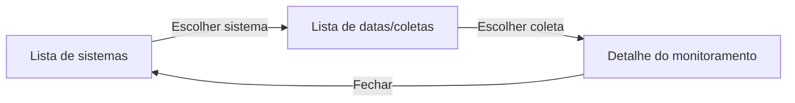

# Mapeamento completo do aplicativo legado Sanetes Rurais

Este documento descreve o comportamento encontrado em `sanetes.aia`. Ele foi
reconstruído a partir dos arquivos de tela (`.scm`) e dos blocos (`.bky`), sem
executar ou alterar os serviços externos.

## 1. Visão geral

O projeto é um aplicativo Kodular/App Inventor Android, versão 1.0, orientação
retrato e Android mínimo 21. Há cinco telas físicas, mas o fluxo funcional se
divide em dois caminhos:

1. **Usuário de campo:** login → questionário → fotos → feedback → fechar.
2. **Administrador:** login especial → sistemas/usuários → cadastros →
   monitoramentos → detalhes.



## 2. Mapa das telas e navegação

| Tela legada | Papel real | Entradas | Saídas principais |
|---|---|---|---|
| `Screen1` | Login e apresentação | Inicialização do app | Administrador → `Visualizacao_de_Usuarios`; usuário → `Responder_Questionario` |
| `Cadastro_sistema_IRPAA` | Cadastro de sistema e credencial associada | Administração | Início → `Visualizacao_de_Usuarios`; sair → fecha o app |
| `Responder_Questionario` | Assistente completo de monitoramento | Login de usuário | Fecha o aplicativo ao terminar |
| `Visualizacao_de_Usuarios` | Na prática, cadastro/listagem de sistemas com credenciais | Login administrativo | Cadastro → `Cadastro_sistema_IRPAA`; Dados → `Visualizacao_de_Sistemas_preenchidos`; sair → fecha |
| `Visualizacao_de_Sistemas_preenchidos` | Lista e detalhe de monitoramentos | Administração | Início → `Visualizacao_de_Usuarios`; Cadastro → `Cadastro_sistema_IRPAA`; sair → fecha |

Observações de navegação:

- O aplicativo abre a nova tela e fecha a anterior em quase todas as trocas.
- O botão visual **Início** da tela `Visualizacao_de_Usuarios` não possui evento
  correspondente nos blocos.
- Na tela de dados, fechar o detalhe abre novamente a própria tela
  `Visualizacao_de_Sistemas_preenchidos` e fecha a instância atual.
- O questionário não oferece um retorno funcional ao login. Vários elementos
  com texto **Sair** ou **Voltar** não têm evento associado.

## 3. Login (`Screen1`)

### Inicialização

1. Monta uma URL CSV para a aba `cadastro` da planilha de sistemas.
2. Define `logado = "nao"`.
3. Ajusta alguns tamanhos de fonte conforme a largura da tela.
4. Mostra o botão Entrar e esconde a animação de carregamento.
5. Executa `TinyDB.ClearAll`, apagando todo o estado local anterior.

### Ao tocar em Entrar

1. Consulta o estado da rede.
2. Sem conexão, esconde o formulário e mostra a imagem de aviso offline.
3. Com conexão, verifica primeiro uma credencial administrativa embutida nos
   blocos.
4. Se for administrador, abre `Visualizacao_de_Usuarios` sem consultar o
   servidor.
5. Caso contrário, baixa toda a aba `cadastro` em CSV.

### Autenticação de usuário

O aplicativo percorre todas as linhas do CSV e compara:

- campo digitado de login com a coluna 7;
- campo digitado de senha com a coluna 8.

Quando encontra correspondência:

1. marca `logado = "sim"`;
2. salva a coluna 3, nome do sistema, como `sistema_logado` no TinyDB;
3. abre `Responder_Questionario`.

Quando não encontra, exibe mensagem de erro por aproximadamente quatro
segundos. O processamento não interrompe explicitamente o laço após encontrar
o usuário, embora a navegação normalmente encerre o fluxo visível.

### Conteúdo adicional

O ícone de informação troca o formulário por um cartão “Sobre o Sanetes
Rurais”, contendo descrição do projeto e contatos dos autores. O ícone de fechar
restaura o login.

## 4. Caminho administrativo

### 4.1 Banco de usuários/sistemas (`Visualizacao_de_Usuarios`)

Apesar do título “Banco de usuários”, cada linha representa um **sistema com
seu responsável e suas credenciais**.

#### Carregamento da lista

1. Na inicialização, configura `Web1` e `Web2` para a aba `cadastro`.
2. Dispara as duas consultas e mostra “Carregando, aguarde”.
3. `Web1` percorre o CSV a partir da linha 2.
4. Para cada linha, cria dinamicamente um cartão com:
   - título: coluna 3, nome do sistema;
   - subtítulo: coluna 2, responsável;
   - última visita: coluna 9.

#### Ações sobre um cartão

Ao tocar em um cartão dinâmico, apresenta:

- **Ver:** busca novamente a planilha e abre um painel com todos os dados;
- **Visitado:** pede confirmação e atualiza a data da última visita;
- **Cancelar:** nenhuma alteração.

O painel **Ver** mostra:

| Coluna CSV | Conteúdo |
|---:|---|
| 1 | Data de criação |
| 2 | Nome do responsável |
| 3 | Nome do sistema |
| 4 | Número de indivíduos |
| 5 | Coordenadas geográficas |
| 6 | Cidade/UF |
| 7 | Login |
| 8 | Senha |
| 9 | Data da última visita |

O código exibe login e senha diretamente na interface administrativa.

#### Marcar como visitado

1. Localiza a linha cujo nome do sistema, coluna 3, coincide com o cartão.
2. Copia as colunas 1 a 8 para variáveis locais.
3. Gera a data atual em `dd/MM/yyyy`.
4. Envia uma operação `Update` ao Apps Script, regravando todos os campos e
   substituindo apenas a coluna de última visita.
5. Atualiza o texto do cartão localmente para “visitado em [data]”.

Não existe confirmação robusta da resposta do servidor antes de atualizar a
interface.

#### Navegação administrativa

- botão flutuante `+` → cadastro;
- menu Cadastro → cadastro;
- menu Dados → banco de monitoramentos;
- menu Sair → confirmação e encerramento do aplicativo.

### 4.2 Cadastro (`Cadastro_sistema_IRPAA`)

Campos apresentados:

1. nome do responsável;
2. nome do sistema;
3. coordenadas;
4. número de indivíduos;
5. cidade/UF;
6. login;
7. senha.

#### Envio

1. Tocar em **Cadastrar** abre a confirmação “Deseja finalizar o cadastro?”.
2. Em **Sim**, esconde o formulário e mostra a animação de envio.
3. Monta uma chamada `GET` ao Apps Script com `func=Create` e todos os campos na
   URL.
4. Acrescenta data/hora e define a última visita inicial como `--/--/----`.
5. Se a resposta textual for exatamente `Sucesso`, mostra a animação de
   sucesso; qualquer outro conteúdo é exibido como mensagem de retorno.

Não há validação visível de campos obrigatórios, formato de coordenadas,
número, duplicidade de login ou codificação segura dos parâmetros.

### 4.3 Banco de monitoramentos (`Visualizacao_de_Sistemas_preenchidos`)

Este fluxo possui três estados internos:



#### Estado 1 — sistemas

1. Carrega a aba `cadastro`.
2. Percorre os registros em dois laços com passo 2, começando nas linhas 2 e 3.
3. Cria cartões em duas colunas visuais alternadas.
4. Cada cartão mostra ícone de pasta e o nome do sistema, coluna 3.

#### Estado 2 — coletas do sistema

1. Ao tocar no sistema, carrega toda a aba `dados`.
2. Filtra registros cuja coluna 2 **contém** o nome selecionado.
3. Para cada resultado, cria um cartão com:
   - título: sistema, coluna 2;
   - subtítulo: data/hora da coleta, coluna 1.

O uso de “contém” pode misturar sistemas com nomes semelhantes.

#### Estado 3 — detalhe

Ao escolher uma coleta, carrega novamente toda a aba `dados` e seleciona a linha
cuja coluna 1 é igual à data/hora escolhida. Exibe:

| Colunas | Conteúdo |
|---:|---|
| 1 | Data e hora da coleta |
| 2 | Nome do sistema |
| 3–19 | Respostas Q1–Q17 |
| 20 | Relato/dificuldade de manejo |
| 21 | Foto da caixa de gordura |
| 22 | Foto da lagoa de estabilização |
| 23 | Foto da amostra de entrada |
| 24 | Foto da amostra de saída |

A seleção pelo horário não combina também o sistema; registros com o mesmo
valor de data/hora poderiam gerar uma associação incorreta.

## 5. Caminho do usuário de campo

### 5.1 Introdução do monitoramento

A tela informa que o usuário responderá perguntas sobre entrada e saída e pede
que o aparelho permaneça conectado.

- **Continuar:** inicia o assistente e define a etapa 1.
- **Não:** existe visualmente, mas seu evento está vazio; tocar não faz nada.

O estado é controlado por `contagem_tela_var`, um número de 0 a 11. Em vez de
rotas internas, o app esconde e mostra grandes grupos de componentes.

### 5.2 Entrada do sistema — Q1 a Q7

Orientação: coletar 500 ml da entrada, após a caixa de gordura.

#### Etapa 1 — Q1 a Q3

1. A amostra está turva? **Sim/Não**
2. Tipo de odor? **Característico/Desagradável**
3. Apresenta espuma? **Sim/Não**

Todas são obrigatórias. O avanço salva as respostas no TinyDB e abre a etapa 2.

#### Etapa 2 — Q4 e Q5

4. Apresenta óleos e gorduras? **Sim/Não**
5. A caixa de gordura foi limpa? **Sim/Não**

Se Q5 for Sim, a data da última limpeza se torna obrigatória e o valor salvo é
`sim, [data]`. Se for Não, salva apenas `não`.

#### Etapa 3 — Q6 e Q7

6. Foi descartado lodo do reator UASB? **Sim/Não**
7. A lagoa foi esvaziada e o lodo de fundo descartado? **Sim/Não**

Se a resposta for Sim, a respectiva data da última operação é obrigatória e
fica concatenada à resposta.

Depois, mostra uma confirmação de que a entrada foi salva e oferece
**Preencher saída**.

### 5.3 Saída do sistema — Q8 a Q17

Orientação: coletar uma amostra no tanque de armazenamento.

#### Etapa 5 — Q8 e Q9

8. A amostra está turva? **Sim/Não**
9. Tipo de odor? **Característico/Desagradável**

#### Etapa 6 — Q10 e Q11

10. Apresenta espuma? **Sim/Não**
11. Apresenta óleos e gorduras? **Sim/Não**

#### Etapa 7 — Q12, grupo visual

12. Com qual grupo de cores a amostra mais se parece?

- amostra verde → `CLUSTER 2`;
- amostra marrom → `CLUSTER 1`;
- amostra marrom escuro → `CLUSTER 0`;
- nenhuma → `NENHUM CLUSTER`.

O valor “cluster” não corresponde à ordem visual dos assets, por isso esse
mapeamento deve ser preservado explicitamente na migração.

#### Etapa 8 — Q13, faixa específica

Após selecionar o grupo, o app mostra somente os números compatíveis. O número
visual dentro de cada grupo é convertido para um código global:

| Grupo visual | Opção exibida → valor salvo |
|---|---|
| Verde | 1→13, 2→6, 3→8, 4→5, 5→2, 6→10, 7→9, 8→15, 9→14, 10→12 |
| Marrom | 1→3, 2→4 |
| Marrom escuro | 1→7, 2→11, 3→1 |
| Nenhum | `NENHUM CLUSTER` |

Esse remapeamento sugere que os valores 1–15 representam uma classificação
global, enquanto os botões são posições dentro de cada paleta.

#### Etapa 9 — Q14 e Q15

14. Destino do esgoto tratado:
   - Reúso agrícola — exige informar o tipo de cultura;
   - Outro — exige descrição no mesmo campo textual.
15. Permanência na lagoa:
   - menos de 7 dias;
   - entre 7 e 9 dias;
   - acima de 9 dias.

Q14 é armazenada como `Reúso agrícola: [texto]` ou `Outro: [texto]`.

#### Etapa 10 — Q16 e Q17

16. Filtro de linha e gotejadores foram limpos? **Sim/Não**
17. A bomba foi limpa? **Sim/Não**

Respostas Sim exigem a data da última limpeza. Ao concluir, a etapa passa a 11
e mostra a confirmação da saída.

### 5.4 Relato de manejo

O usuário pode escrever uma dúvida ou dificuldade. O campo não é obrigatório;
ao avançar, seu conteúdo é salvo em `relato` no TinyDB e a tela de fotos é
aberta.

### 5.5 Fotografias

Quatro imagens são obrigatórias:

1. caixa de gordura com o efluente visível;
2. lagoa de estabilização;
3. amostra da entrada, sem flash;
4. amostra da saída, sem flash.

Cada foto pode vir da galeria ou da câmera. O app guarda caminhos locais em
quatro variáveis e mostra uma prévia.

O tratamento da câmera é incomum: não há eventos `Camera.AfterPicture`. O app
usa `Form.ErrorOccurred`, flags `FOTOGRAFANDO_1..4` e busca arquivos recentes na
pasta `Pictures` para tentar recuperar a foto. Isso é frágil e dependente do
comportamento/versão do Android.

### 5.6 Envio final

O botão Enviar funciona somente quando:

- há rede;
- o assistente chegou à etapa 11;
- os quatro caminhos de imagem são diferentes de `nada`.

Então:

1. cria um identificador temporal `ddMMyyyyhhmmss`;
2. inicia quatro uploads no Firebase Storage, na ordem 1, 3, 2, 4;
3. cada sucesso grava a URL recebida em `imagemlink_1..4` no TinyDB;
4. quando o sucesso identificado como `imagem4` chega, monta a URL final;
5. envia por `GET` data, sistema, Q1–Q17, relato e quatro links ao Apps Script;
6. troca imediatamente para o feedback.

Há uma condição de corrida importante: o código presume que `imagem4` terminará
por último. Se terminar antes dos outros uploads, os respectivos links ainda
podem estar vazios ou antigos quando o registro for enviado.

Também não existe evento `Web.GotText` nessa tela. Portanto, o app não aguarda
nem verifica o resultado do cadastro do monitoramento antes de declarar
sucesso.

### 5.7 Feedback calculado localmente

O feedback não vem do backend; é calculado com Q9, Q12 e Q15:

- Se Q12 for um cluster conhecido, informa que a situação provavelmente é boa
  e mostra a tabela laboratorial do cluster correspondente.
- Se Q12 for `NENHUM CLUSTER`, informa que o sistema necessita de visita para
  adequação e avaliação.
- Q15 “menos de 7 dias” recomenda aumentar a permanência para 7 dias.
- Q15 “acima de 9 dias” recomenda diminuir a permanência para 7 dias.
- Q9 “odor desagradável” informa que o IRPAA fará uma visita.

O botão Fechar pede confirmação e encerra o aplicativo.

## 6. Estado local

Tags encontradas no TinyDB:

```text
sistema_logado
Q1 ... Q17
relato
imagemlink_1 ... imagemlink_4
```

O TinyDB é usado como memória intermediária entre as etapas, não como suporte
offline confiável. Todo o banco local é apagado quando `Screen1` inicializa.
Assim, um formulário interrompido não pode ser retomado depois de reabrir o app.

## 7. Integrações e modelo de dados legado

### Planilha `cadastro`

```text
1 data_criacao
2 responsavel
3 sistema
4 numero_individuos
5 coordenadas
6 cidade_uf
7 login
8 senha
9 ultima_visita
```

### Planilha `dados`

```text
1 data_hora
2 sistema
3..19 Q1..Q17
20 relato_manejo
21 foto_caixa_gordura
22 foto_lagoa
23 foto_amostra_entrada
24 foto_amostra_saida
```

### Serviços

- Google Sheets CSV: leitura integral das abas `cadastro` e `dados`;
- Google Apps Script: criação/atualização por query string e método HTTP GET;
- Firebase Storage: armazenamento das quatro fotos;
- TinyDB: estado temporário no aparelho;
- Network: teste simples de conectividade;
- Dynamic Components: criação das listas administrativas;
- Camera/ImagePicker/File: captura e seleção de fotos.

## 8. Blocos redundantes, mortos ou estruturalmente caros

O tamanho do projeto não representa igual complexidade funcional.

### Redundância estrutural

- 46 botões de rádio possuem blocos individuais para desmarcar manualmente os
  demais itens do grupo.
- A paleta verde repete a desmarcação de outros nove rádios em cada evento.
- Listas administrativas recriam cartões, arranjos, espaços, fontes e labels por
  meio de muitos procedimentos separados.
- O mesmo CSV é convertido novamente em lista dentro de vários laços e
  comparações.
- Ajustes responsivos repetem multiplicações de tamanho para diversos labels.

### Blocos/controles sem efeito útil

- `CV_NAO_INICIAL.Click` está vazio.
- Há um procedimento desabilitado no questionário.
- Existe um bloco de formatação de data solto, desconectado, no cadastro.
- Vários controles visuais “Sair” e “Voltar” do questionário não possuem evento.
- O menu visual Início da tela de usuários não possui evento.
- A animação `failure.json` e o logo IRPAA não possuem referência ativa.
- `ProCamera` existe na tela, mas o fluxo efetivo usa quatro componentes
  `Camera` e o tratamento indireto por erro.

## 9. Fragilidades que não devem ser migradas literalmente

1. Credencial administrativa embutida no app.
2. Download de toda a tabela de usuários e senhas para autenticação local.
3. Senhas armazenadas e exibidas em texto legível.
4. Dados e senha enviados em query string por `GET`.
5. Ausência de sessão, autorização por função e proteção real das telas.
6. Formulário apagado ao reiniciar; não existe retomada offline.
7. Uploads paralelos com dependência implícita de a quarta foto terminar por
   último.
8. Feedback exibido antes de confirmação do backend.
9. Identificação de entidades por nome ou data/hora, em vez de IDs imutáveis.
10. Filtro de sistemas com operação “contém”.
11. Captura de câmera baseada em `ErrorOccurred` e varredura da pasta Pictures.
12. Ausência de validação consistente no cadastro administrativo.
13. Navegação baseada em abrir/fechar telas, com botões visuais sem ação.
14. Quatro fotografias enviadas como operações independentes, sem transação ou
    estado de sincronização.

## 10. Fluxo equivalente recomendado para a nova stack

```text
/login
  ├── administrador → /admin/sistemas
  │   ├── /admin/sistemas/novo
  │   ├── /admin/sistemas/:id
  │   └── /admin/monitoramentos
  │       └── /admin/monitoramentos/:id
  └── usuário de campo → /monitoramentos/novo
      ├── /entrada
      ├── /saida
      ├── /relato
      ├── /fotos
      ├── /revisao-e-sincronizacao
      └── /resultado
```

Regras a preservar:

- conteúdo e obrigatoriedade das Q1–Q17;
- datas condicionais em Q5, Q6, Q7, Q16 e Q17;
- texto complementar obrigatório em Q14;
- mapeamento especial de Q12 e Q13;
- quatro categorias distintas de fotografia;
- recomendações derivadas de Q9, Q12 e Q15;
- registro da última visita ao sistema.

Regras a melhorar:

- usuários, sistemas e monitoramentos com IDs UUID;
- autenticação na API com senha hash e perfis;
- rascunho local persistente e retomável;
- sincronização com estados `draft`, `pending`, `syncing`, `synced`, `failed`;
- upload confirmado de cada foto antes de concluir o monitoramento;
- resposta confirmada da API antes do feedback final;
- listas e grupos de seleção gerados a partir de dados, sem blocos repetidos;
- navegação única e previsível em React Router.

